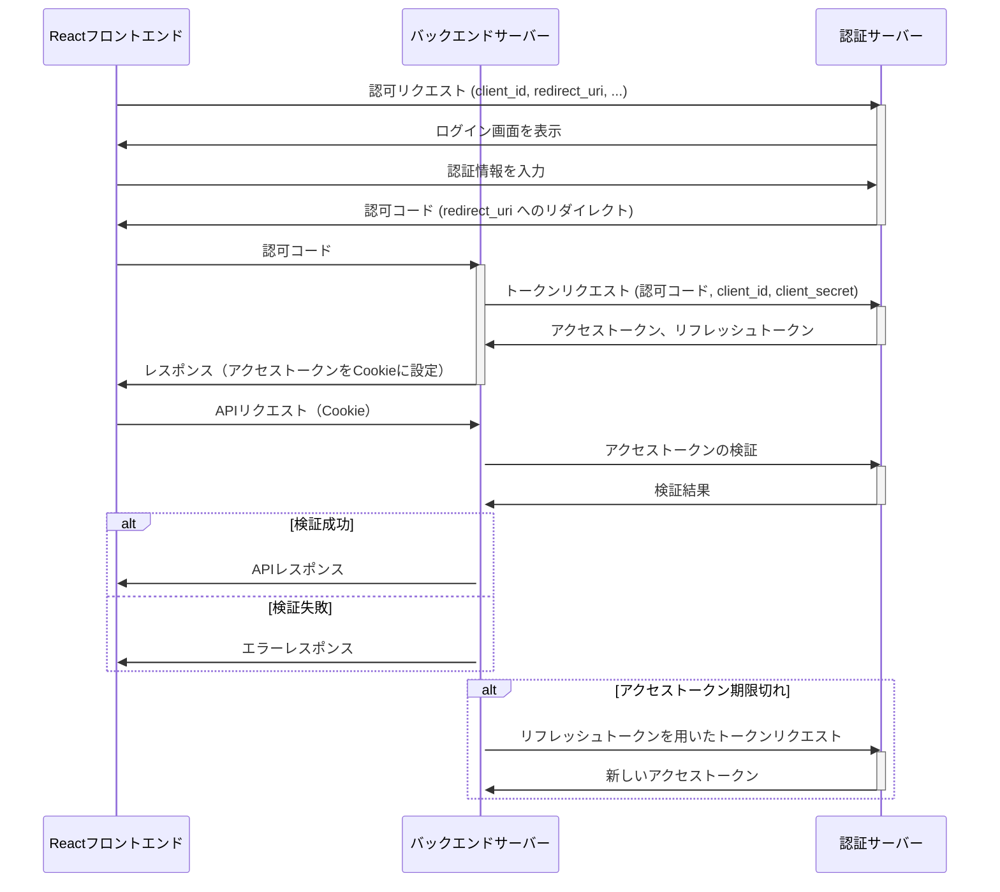

```mermaid
sequenceDiagram
  participant Reactフロントエンド
  participant バックエンドサーバー
  participant 認証サーバー

  Reactフロントエンド->>認証サーバー: 認可リクエスト (client_id, redirect_uri, ...)
  activate 認証サーバー
  認証サーバー->>Reactフロントエンド: ログイン画面を表示
  Reactフロントエンド->>認証サーバー: 認証情報を入力
  認証サーバー->>Reactフロントエンド: 認可コード (redirect_uri へのリダイレクト)
  deactivate 認証サーバー

  Reactフロントエンド->>バックエンドサーバー: 認可コード
  activate バックエンドサーバー
  バックエンドサーバー->>認証サーバー: トークンリクエスト (認可コード, client_id, client_secret)
  activate 認証サーバー
  認証サーバー->>バックエンドサーバー: アクセストークン、リフレッシュトークン
  deactivate 認証サーバー

  バックエンドサーバー->>Reactフロントエンド: レスポンス（アクセストークンをCookieに設定）
  deactivate バックエンドサーバー

  Reactフロントエンド->>バックエンドサーバー: APIリクエスト（Cookie）
  activate バックエンドサーバー
  バックエンドサーバー->>認証サーバー: アクセストークンの検証
  activate 認証サーバー
  認証サーバー->>バックエンドサーバー: 検証結果
  deactivate 認証サーバー

  alt 検証成功
    バックエンドサーバー->>Reactフロントエンド: APIレスポンス
  else 検証失敗
    バックエンドサーバー->>Reactフロントエンド: エラーレスポンス
  end

  alt アクセストークン期限切れ
    バックエンドサーバー->>認証サーバー: リフレッシュトークンを用いたトークンリクエスト
    activate 認証サーバー
    認証サーバー->>バックエンドサーバー: 新しいアクセストークン
    deactivate 認証サーバー
  end
```